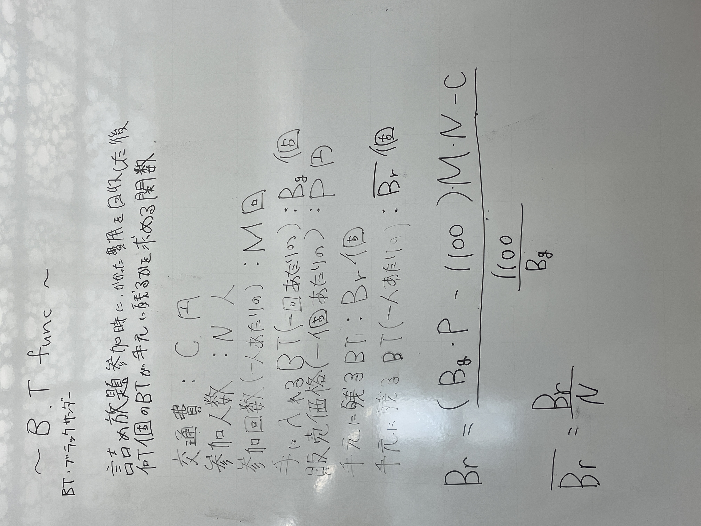
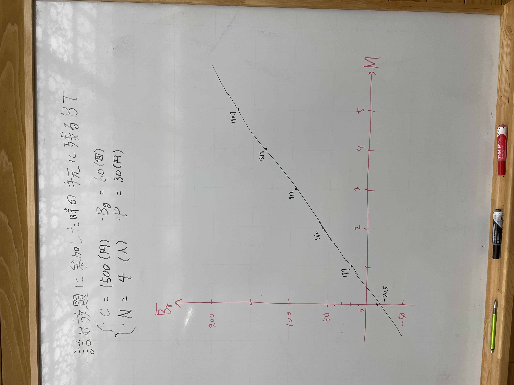

# B.T. Func
B.T.: ブラックサンダー

詰め放題参加時にかかった費用を回収した後、何このBTが手元に残るかを求める関数

- 交通費: $C$円
- 参加人数: $N$人
- 参加回数(一人あたり): $M$回
- 手に入るBT(一回あたり): $B_g$個
- 販売価格(一個あたり): $P$円
- 手元に残るBT: $B_r$個
- 手元に残るBT(一人あたり): $\bar{B_r}$

$$
B_r = \frac{(B_gP - 1100)MN - C}{\frac{1100}{B_g}}
$$

## 使用例
ブラックサンダー公式ワクザクファクトリーにて詰め放題に参加し、ブラックサンダーを売り払うとした場合において、掛かった費用を回収した上で、手元に残る個数を求めたい。

例:
- 交通費: $1500$円
- 参加人数: $4$人
- 参加回数(一人あたり): $2$回
- 手に入るBT(一回あたり): $60$個
- 販売価格(一個あたり): $30$円

この時、
- 手元に残るBT $B_r = 70.9$個
- 手元に残るBT(一人あたり) $\bar{B_r} = 17.7$

## LICENSE
[MIT](./LICENSE)
